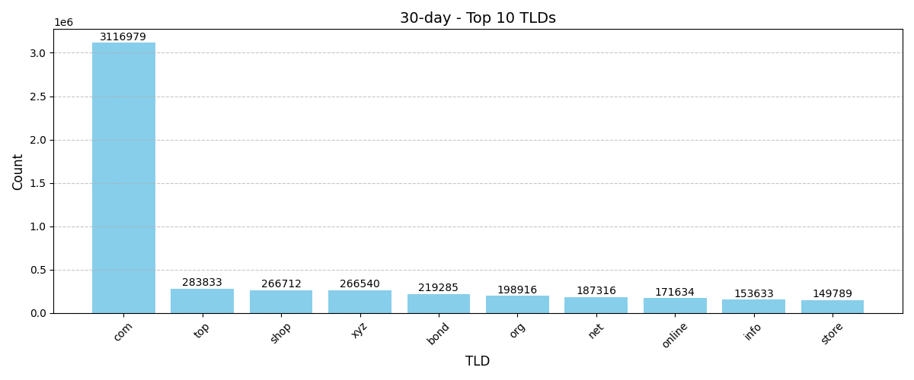

# 🛡️ NRD Lists - Block Newly Registered Domains

Effortlessly block newly registered domains (NRDs) that are often used for malicious purposes, phishing, and tracking. The NRD lists are updated frequently and are compatible with a variety of DNS filtering and ad-blocking tools.

---

## 📜 Available Lists

| **List Name**              | **Description**                              | **Split**       |
|----------------------------|-------------------------------------------|-----------------|
| **14-Day NRD**             | Blocks domains registered in the past 14 days. | No split        |
| **30-Day NRD**             | Blocks domains registered in the past 30 days. | Split into parts|
| **14-Day Phishing NRD**    | Targets phishing domains from the past 14 days. | No split        |
| **30-Day Phishing NRD**    | Targets phishing domains from the past 30 days. | Split into parts|

---

## 🔧 Features

| **Feature**                  | **Details**                                                                                   |
|---------------------------------|--------------------------------------------------------------------------------------------|
| 🛑 **Block NRDs**            | Stops access to newly registered domains before they can be weaponized for phishing or malware. |
| 🔒 **Privacy Protection**    | Blocks newly created domains often used for tracking and data collection.                       |
| 🚫 **Phishing Protection**   | Focused phishing lists block high-risk domains specifically flagged for fraud.                  |
| ⚡ **Multi-Format Support**  | Lists are available in Domain-only, Adblock, Wildcard, Unbound and Base64 formats for seamless compatibility.          |

---

## 📂 Supported Formats

| **Format**         | **Purpose**                          | **Compatible Tools**                                                                                    |
|-------------------|-------------------------------------|------------------------------------------------------------------------------------------------------|
| **Domain-only**  | Standard domain list for DNS filtering tools and analysis. | DNSCloak, DNSCrypt, PersonalDNSfilter, InviZible Pro                                                            
| **Adblock**       | Adblock Syntax for use with supported tools. | Pi-hole, AdGuard Home, TechnitiumDNS, uBlock, AdBlock, AdBlock Plus, Opera, Vivaldi, Brave, AdNauseam, eBlocker
| **Wildcard**       | Flexible DNS blocking with wildcard patterns. | Blocky (v0.23+), Nebulo, NetDuma, OPNsense, YogaDNS
| **Unbound**       | Importing for unbound.conf | Unbound
| **Base64**       | Mainly to decode it yourself into your own format | Suricata                                                        |

---

## 🛠️ List Update Schedule

- **Lists are updated at least once every 24h at 5:10 UTC**
- Files are timestamped to reflect the latest update cycle.

---

## 🚨 Important Notes

- **False Positives:** Legitimate domains may sometimes be blocked. Review the lists and whitelist any domains essential to you.
- **Phishing Lists:** Specifically target domains flagged for phishing activities.
- **File size:** The Lists are huge! Expect your tools or browser to crash without enough system memory!

---

## 📖 License

This project is licensed under the **MIT License**. See the [LICENSE](LICENSE) file for more details.

---

## 🔗 Quick Links

- [Explore All Lists in my NRD Repository](https://github.com/xRuffKez/NRD/tree/main/lists)
- [HaGeZi's DNS Blocklist Project](https://github.com/hagezi/dns-blocklists#readme)
- [Buy me a Coffee](https://buymeacoffee.com/xruffkez) if you like my work! 😊

---

## 🤝 Credits

- [Stamus Networks](https://www.stamus-networks.com/) for the NRD Lists
- [openSquat](https://opensquat.com/index.html) for the NRD Lists
- [HaGeZi](https://github.com/hagezi) for his helping hand and his great Blocklists

---

## NRD 30 Top 10 Tlds

---

## Star History

